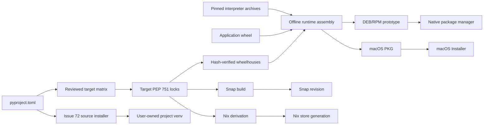

# Reproducible Runtime Artifact Design

Status: design-only draft for [Issue #60](https://github.com/Hkshoonya/nvidia-broadcast-linux/issues/60)

This document proposes how NV Broadcast release artifacts can carry a complete,
locked Python runtime without resolving dependencies during installation. It is
not an implementation: it adds no downloader, activation mechanism, UI, worker,
installer behavior, workflow, or runtime behavior.

The design builds on the CPU/CUDA ownership work in [Issue
#53](https://github.com/Hkshoonya/nvidia-broadcast-linux/issues/53), the
interpreter-selection boundary in [Issue
#72](https://github.com/Hkshoonya/nvidia-broadcast-linux/issues/72), and the
maintainer's [design constraints for Issue
#60](https://github.com/Hkshoonya/nvidia-broadcast-linux/issues/60#issuecomment-5400149798).

## Decisions and open questions

| Topic | Status | Contract |
| --- | --- | --- |
| Maintained dependency source | Accepted | `pyproject.toml` remains the source maintainers edit. Target locks and manifests are generated outputs. |
| Project Python support | Accepted | Keep `requires-python = ">=3.11"`. A release payload may use one fixed CPython ABI without narrowing source-install support. |
| Lock format | Accepted | Generate one PEP 751 `pylock.<target>.toml` file for each target and runtime variant. |
| Lock tool | Proposed | Use an exact, checksum-pinned `uv` release for resolution and PEP 751 export. Record that tool identity in generated metadata. |
| First runtime variants | Accepted | Build CPU and CUDA artifacts. TensorRT is not part of the first milestone. |
| Meeting compatibility | Accepted | Preserve the OpenAI Whisper compatibility path. Managed-runtime metadata must declare `faster-whisper` directly and suppress only its `onnxruntime` dependency for runtime-owner selection. |
| Native interpreter | Proposed | Evaluate a hash-pinned `python-build-standalone` CPython archive owned by the DEB, RPM, or PKG. Approval depends on redistribution, native-binding, relocation, and oldest-platform tests. |
| Native package shape | Open | Compare a self-contained package per variant with an application/runtime package split before selecting either model. |
| Verification evidence | Accepted | Finalize target-specific signing, notarization, and stapling before lifecycle and hardware tests. Those tests and their attestations name the exact finalized artifact digest; unsigned payload digests remain separate reproducibility evidence. |
| Reproducibility claim | Accepted | Milestone 1 reproduces assembly from exact upstream artifacts. Independently rebuilding every third-party wheel from source is later supply-chain work. |
| Runtime activation | Accepted boundary | Package-managed and Snap installations remain externally managed. Atomic candidate activation is limited to user-owned source installs under Issue #53. |

No open item may be silently converted into an implementation choice. A later
implementation PR must either cite the accepted decision or keep both options
behind separate build prototypes.

## Goals and invariants

The artifact pipeline must enforce these properties:

1. Package installation, upgrade, rollback, and removal do not resolve or
   download ordinary Python dependencies.
2. `pyproject.toml` owns dependency intent. Generated locks select exact
   versions, files, and hashes for one target.
3. Every managed environment contains exactly one ONNX Runtime distribution:
   `onnxruntime` for CPU or `onnxruntime-gpu` for CUDA.
4. A managed Python runtime contains its matching interpreter, application
   wheel, Python dependencies, and Python ABI extensions. A wheelhouse alone is
   not described as a complete runtime.
5. Host-owned native libraries and services remain explicit package
   dependencies. They are not accidentally imported from system Python
   `site-packages`.
6. Official packages never replace `/usr/bin/python`, rewrite the system Python
   installation, or add a third-party package repository on the destination.
7. Package-owned files change only through that package manager. Snap and Nix
   retain their own immutable ownership models.
8. A CUDA artifact is not promoted on provider enumeration alone. It must pass
   the existing fresh-process model execution probe on supported NVIDIA
   hardware without silent CPU fallback.
9. Artifact bytes, embedded manifest, and embedded SBOM are immutable before
   post-build validation. Validation produces separate digest-bound evidence.
10. A missing artifact, incompatible wheel tag, hash mismatch, unresolved
    dependency, or failed required probe stops the build or release. It never
    produces a partial runtime labelled successful.

This proposal does not design live runtime switching, an inference worker, or
new application settings. It also does not make TensorRT a base-runtime
requirement.

## Runtime target matrix

### Initial artifact cells

The first implementation should prove the following cells. `cp313` is a
proposed ABI for official native packages because it is inside the existing
`>=3.11` contract and matches the preferred interpreter from Issue #72. It is
not a change to source-install compatibility.

| Target ID | Platform | Python owner and ABI | Variant | Wheel platform contract | Intended consumers | Status |
| --- | --- | --- | --- | --- | --- | --- |
| `linux-x86_64-cp313-cpu` | glibc Linux, x86-64 | Private package-owned CPython, `cp313` | CPU | `manylinux_2_28_x86_64` or stricter compatible tag | DEB and RPM prototypes | Proposed |
| `linux-x86_64-cp313-cuda12` | glibc Linux, x86-64 | Private package-owned CPython, `cp313` | CUDA 12 | `manylinux_2_28_x86_64` or stricter compatible tag | DEB and RPM prototypes | Proposed |
| `linux-aarch64-cp313-cpu` | glibc Linux, AArch64 | Private package-owned CPython, `cp313` | CPU | `manylinux_2_28_aarch64` or stricter compatible tag | DEB and RPM prototypes | Proposed |
| `macos-arm64-cp313-cpu` | macOS 13+, Apple Silicon | Private PKG-owned CPython, `cp313` | CPU/CoreML | `macosx_13_0_arm64` or compatible older tag | macOS PKG prototype | Proposed |
| `snap-core24-amd64-cp312-cuda12` | Snap `core24`, x86-64 | Snap base/runtime, `cp312` | CUDA 12 | Snap build environment | amd64 Snap | Existing ownership model |
| `snap-core24-arm64-cp312-cpu` | Snap `core24`, AArch64 | Snap base/runtime, `cp312` | CPU | Snap build environment | arm64 Snap | Existing ownership model |

Linux AArch64 CUDA and all TensorRT cells remain outside the first matrix until
their wheel closure, redistribution terms, installed size, and fresh-process
hardware execution are verified. macOS remains CPU/CoreML-only and Apple
Silicon-only under the current support policy.

The `manylinux_2_28` floor is the initial candidate because current MediaPipe,
PyAV, and ONNX Runtime wheels require compatible tags. Full lock and interpreter
validation must confirm the effective floor. It is a compatibility floor, not
a distribution name. A release must test the oldest supported version of every
advertised distribution family. A distribution below the resulting glibc floor
cannot consume that cell; it needs another cell or must not be advertised for
that artifact.

### How consumers receive a matching interpreter

| Consumer | Interpreter supplier | Interpreter updater | Runtime owner | System Python effect |
| --- | --- | --- | --- | --- |
| DEB/RPM with private runtime | Proposed pinned CPython archive fetched and verified in CI | NV Broadcast dependency-update PR and normal package upgrade | Native package manager | None; launcher uses an absolute private interpreter path |
| macOS PKG | Proposed pinned Apple Silicon CPython archive fetched and verified in CI | NV Broadcast dependency-update PR and signed PKG upgrade | Installer receipt/package payload | None; launcher never searches `PATH` for Python |
| Snap | `core24` plus the Snap build | Snap base refresh and a newly built Snap revision | Snap | None |
| Nix/NixOS | Exact Python derivation selected by nixpkgs/Nix expression | Nix input update and new store generation | Nix store/profile | None |
| User-owned source install | Compatible interpreter already installed and explicitly selected under Issue #72 | User or distribution | User-owned project virtual environment | None; only project `.venv` is created |

For private native runtimes, every Python extension must match the private ABI.
That includes bindings such as PyGObject and pycairo; importing a distro's
`python3-gi` from system `site-packages` is not allowed. GTK, GStreamer,
PipeWire/PulseAudio, NVIDIA driver libraries, and other non-Python shared
libraries may remain host-owned, but the package adapter must declare their
versions and the runtime manifest must declare its required shared-library
contract.

The private-interpreter proposal passes its design gate only if a prototype:

- verifies the interpreter archive's source, license set, checksum, relocation,
  and update procedure;
- builds or obtains every required Python ABI extension from locked inputs;
- imports GTK/GStreamer bindings with user and system Python sites disabled;
- runs on the oldest supported glibc and macOS targets; and
- leaves the system Python executable, packages, and import paths unchanged.

If that prototype fails, the fallback is a distro-interpreter matrix. Each
native package would then depend on an exact distribution CPython minor and use
a lock built for that ABI. This increases the number of DEB/RPM artifacts and
cannot be represented as one architecture-independent package, but it still
does not modify the system interpreter. The design must not mix private
`cp313` wheels with another interpreter ABI.

### Distribution-to-consumer mapping

| Advertised platform family | Delivery path | ABI rule | Release gate |
| --- | --- | --- | --- |
| Debian, Ubuntu, Pop!_OS, and Linux Mint | DEB | Private fixed-ABI cell, or an explicitly selected distro-ABI fallback package | Clean install, upgrade, rollback, and purge on each declared minimum release |
| Fedora, RHEL, Rocky Linux, AlmaLinux, and CentOS | RPM | Same runtime cell; adapter owns distribution-specific native dependency names | Clean DNF transaction and lifecycle tests on each declared minimum release |
| openSUSE | RPM only after its dependency mapping is validated | Same runtime cell; no Fedora-only dependency assumptions | Clean Zypper lifecycle test |
| Arch, Manjaro, EndeavourOS, Gentoo, and Void | User-owned source installer unless a native adapter is added | Issue #72 selects an existing compatible interpreter and creates only project `.venv` | Interpreter discovery and runtime probe; musl needs its own artifact proof |
| NixOS | Nix package | Nix-selected interpreter and Python packages form one store closure | Nix build and closure checks; no raw `manylinux` payload assumption |
| macOS 13+ on Apple Silicon | PKG | Private fixed-ABI macOS cell | Clean PKG install, upgrade, rollback procedure, uninstall, and launch |

Support documentation must name tested distribution versions, not infer
support from the package format. Architecture metadata must match the payload;
native wheels cannot remain hidden behind Debian `Architecture: all` or RPM
`BuildArch: noarch`.

## Canonical inputs and lock generation

### Source hierarchy

Dependency data has one direction:

1. Maintainers edit `pyproject.toml`, including packaging-only extras needed to
   create a managed runtime.
2. A small reviewed runtime matrix selects target, ABI, variant, and extras. It
   must not duplicate dependency versions.
3. When a required private-ABI wheel is unavailable upstream, a controlled
   target-specific build turns pinned source and build inputs into an immutable,
   hash-addressed wheel before lock generation.
4. A pinned `uv` release resolves against upstream indexes plus those approved
   wheel inputs and generates target-specific PEP 751 locks.
5. Wheelhouses, runtime manifests, SBOMs, and package payloads derive from those
   locks and the exact source commit.

Generated locks should be committed and reviewed in dependency-update PRs.
Release-tag workflows consume them; they do not re-resolve dependencies.

`faster-whisper` needs an explicit packaging policy because its metadata
depends on CPU `onnxruntime`. Before managed-runtime lock generation is
implemented, `pyproject.toml` must make the pinned backend a direct requirement
of the maintained `meeting-support` extra and use `uv`'s package-scoped
dependency exclusion. The intended metadata is:

```toml
[project.optional-dependencies]
meeting-support = [
    "faster-whisper==1.2.1",
    "ctranslate2",
    "huggingface-hub",
    "httpx",
    "tokenizers",
    "soundfile",
    "tqdm",
]

[tool.uv]
exclude-dependencies = [
    { package = { name = "faster-whisper", version = "1.2.1" }, dependencies = ["onnxruntime"] },
]
```

The table form scopes the exclusion to the `faster-whisper==1.2.1` parent. It
does not globally exclude `onnxruntime`, alter other packages' metadata, or
remove any other `faster-whisper` requirement. CPU and CUDA locks must include
the `faster-whisper` wheel and every other applicable dependency declared by
that wheel while selecting exactly one ONNX Runtime owner. This design-only PR
documents the required future metadata; it does not change current source
installer behavior.

The guarded OpenAI Whisper dependency remains governed by its existing Python
marker. For a selected feature set, lock generation evaluates that marker
normally; packaging work does not remove or silently replace it.

### Matrix schema example

This example is illustrative. Exact interpreter and `uv` versions must be real
pins, not placeholders, when implementation begins.

```toml
schema-version = 1

[lock-tool]
name = "uv"
version = "<exact reviewed version>"
archive-sha256 = "<sha256>"

[[targets]]
id = "linux-x86_64-cp313-cpu"
os = "linux"
arch = "x86_64"
python-version = "3.13.<patch>"
python-abi = "cp313"
python-platform = "x86_64-manylinux_2_28"
variant = "cpu"
extras = ["cpu", "meeting", "meeting-support", "native-runtime"]
lock = "locks/pylock.linux-x86_64-cp313-cpu.toml"
interpreter-owner = "native-package"
interpreter-supplier = "python-build-standalone"
interpreter-url = "<immutable release URL>"
interpreter-sha256 = "<sha256>"
external-dependency-profile = "linux-glibc-desktop-v1"
consumers = ["deb", "rpm"]

[[targets]]
id = "macos-arm64-cp313-cpu"
os = "macos"
arch = "arm64"
minimum-os-version = "13.0"
python-version = "3.13.<patch>"
python-abi = "cp313"
python-platform = "aarch64-apple-darwin"
variant = "cpu"
extras = ["cpu", "meeting", "meeting-support", "native-runtime"]
lock = "locks/pylock.macos-arm64-cp313-cpu.toml"
interpreter-owner = "macos-pkg"
interpreter-supplier = "python-build-standalone"
interpreter-url = "<immutable release URL>"
interpreter-sha256 = "<sha256>"
external-dependency-profile = "macos-homebrew-desktop-v1"
consumers = ["pkg"]
```

Required target fields are `id`, OS, architecture, full interpreter version,
Python ABI, resolver platform, runtime variant, selected project extras, lock
path, interpreter supplier/owner/source/hash, external dependency profile, and
package consumers. Unknown fields and duplicate target IDs must fail schema
validation.

### Lock command examples

`uv pip compile` performs platform-specific resolution when given
`--python-platform` and `--python-version`. PEP 751 output includes artifact
hashes. These commands are conditional examples, not commands that work against
current `pyproject.toml`: the proposed extras and every required binary wheel
must exist first. Example CPU and CUDA resolutions are:

```bash
uv pip compile pyproject.toml \
  --extra cpu \
  --extra meeting \
  --extra meeting-support \
  --extra native-runtime \
  --python-version 3.13 \
  --python-platform x86_64-manylinux_2_28 \
  --only-binary :all: \
  --format pylock.toml \
  --output-file locks/pylock.linux-x86_64-cp313-cpu.toml

uv pip compile pyproject.toml \
  --extra cuda \
  --extra meeting \
  --extra meeting-support \
  --extra native-runtime \
  --python-version 3.13 \
  --python-platform x86_64-manylinux_2_28 \
  --only-binary :all: \
  --format pylock.toml \
  --output-file locks/pylock.linux-x86_64-cp313-cuda12.toml
```

`native-runtime` is a proposed packaging-only extra, not a new user-facing
feature. It would make private-ABI bindings such as PyGObject explicit in the
maintained dependency source.

Lock generation must reject source distributions for milestone 1 unless a
specific dependency is approved for a controlled, reproducible wheel-build
step. The private-interpreter prototype must build missing target wheels such as
PyGObject or pycairo before any `--only-binary :all:` lock command. Each build
records the source URL and hash, complete build recipe, toolchain and build
dependencies, target ABI and platform tags, output wheel hash, and provenance.
The resulting wheel is published as an immutable, pinned resolver input. Lock
generation fails if any selected target still lacks an approved binary wheel;
offline assembly never builds one.

### Lock and wheelhouse validation

For every target, CI must:

- validate the PEP 751 file and its `requires-python` contract;
- verify that every selected archive has a SHA-256 hash;
- reject packages or files absent from the lock;
- reject incompatible Python, ABI, architecture, macOS, `manylinux`, or
  `musllinux` tags;
- reject source distributions unless explicitly allowed by the target policy;
- verify exactly one ONNX Runtime distribution and the expected variant;
- read the selected `faster-whisper` wheel metadata, verify that only its
  `onnxruntime` edge was suppressed, and require every other applicable
  `Requires-Dist` dependency in the lock and wheelhouse; and
- verify that every wheelhouse file is referenced exactly once and every lock
  artifact required by the environment is present.

The network-enabled fetch step copies only lock-selected files into a flat,
read-only wheelhouse and verifies each byte stream before naming it complete.
The later assembly step has no network access. An illustrative offline sync is:

```bash
uv pip sync locks/pylock.linux-x86_64-cp313-cpu.toml \
  --python staging/runtime/python/bin/python3 \
  --no-index \
  --find-links staging/wheelhouse \
  --require-hashes \
  --offline \
  --strict
```

The implementation must use an assembler that consumes PEP 751 artifact URLs
and hashes directly; it must not perform a second dependency resolution to
populate the wheelhouse. That assembler is deliberately not added by this
design-only PR.

## Artifact layout and schemas

### Build artifacts

Each matrix cell produces separate inputs and a complete runtime payload:

```text
artifacts/
  locks/
    pylock.linux-x86_64-cp313-cpu.toml
  wheelhouses/
    linux-x86_64-cp313-cpu/
      wheels/
        <exact locked wheel files>
      wheelhouse-manifest.json
  runtimes/
    linux-x86_64-cp313-cpu/
      python/
        bin/python3
        lib/python3.13/
      bin/
        nvbroadcast
        nvbroadcast-vcam
      app/
        <application files and immutable resources>
      metadata/
        runtime-manifest.json
        sbom.spdx.json
        pylock.toml
        licenses/
```

The runtime does not contain `pip`, `uv`, compiler toolchains, lock credentials,
download caches, user configuration, models that retain their own verified
download lifecycle, or build-host paths. Launchers execute the private
interpreter by absolute path and disable user-site injection.

External host requirements are part of the contract, not omitted from it. The
manifest names required shared libraries, driver constraints, GStreamer
plugins, virtual-camera integration, and package-adapter dependency profile.

### Wheelhouse manifest

`wheelhouse-manifest.json` records the target ID, lock digest, and, for every
archive, its normalized project name, version, filename, size, SHA-256 digest,
source URL, and selected wheel tags. It contains no verification result and no
credentials. Its file set must exactly match the wheelhouse directory.

### Runtime manifest example

```json
{
  "schemaVersion": 1,
  "artifactId": "linux-x86_64-cp313-cpu",
  "application": {
    "name": "nvbroadcast",
    "version": "<release version>",
    "sourceCommit": "<full commit SHA>",
    "wheelSha256": "<sha256>"
  },
  "target": {
    "os": "linux",
    "arch": "x86_64",
    "pythonImplementation": "cpython",
    "pythonVersion": "3.13.<patch>",
    "pythonAbi": "cp313",
    "platform": "manylinux_2_28_x86_64",
    "variant": "cpu"
  },
  "interpreter": {
    "supplier": "python-build-standalone",
    "sourceUrl": "<immutable release URL>",
    "sourceSha256": "<sha256>"
  },
  "inputs": {
    "pyprojectSha256": "<sha256>",
    "lockSha256": "<sha256>",
    "wheelhouseManifestSha256": "<sha256>",
    "lockTool": "uv <exact version>"
  },
  "runtime": {
    "contentSetSha256": "<canonical file-set digest>",
    "externalDependencyProfile": "linux-glibc-desktop-v1"
  }
}
```

The enclosing archive digest is intentionally absent: embedding it would be
circular. Release checksums and attestations identify the final DEB, RPM, PKG,
Snap, or runtime archive digest. `contentSetSha256` covers a canonical list of
payload paths, modes, sizes, and hashes, excluding the manifest itself.

The manifest must not contain fields such as `verified`, `testsPassed`, or
`hardwareStatus`. Adding those after testing would create a different artifact
from the one that was tested.

### Verification attestation example

Post-build evidence is an in-toto statement whose subject is the exact final
artifact:

```json
{
  "_type": "https://in-toto.io/Statement/v1",
  "subject": [
    {
      "name": "nvbroadcast-<version>-linux-x86_64-cuda12.rpm",
      "digest": { "sha256": "<final artifact sha256>" }
    }
  ],
  "predicateType": "https://nvbroadcast.domjarvis.com/attestations/runtime-verification/v1",
  "predicate": {
    "targetId": "linux-x86_64-cp313-cuda12",
    "sourceCommit": "<full commit SHA>",
    "artifactState": "finalized",
    "contentSetSha256": "<embedded runtime manifest content-set sha256>",
    "checks": [
      "platform-signature",
      "package-lifecycle",
      "dependency-closure",
      "fresh-process-cuda-execution",
      "no-silent-cpu-fallback"
    ],
    "runner": "<reviewed runner identity>",
    "completedAt": "<RFC 3339 timestamp>"
  }
}
```

`artifactState: "finalized"` means every byte-changing operation required for
that target, including package signing and applicable Developer ID signing,
notarization, and stapling, finished before the subject digest was calculated.
No job may rewrite a finalized artifact. `contentSetSha256` must match the
canonical installed-content digest in the artifact's embedded runtime manifest.

Build provenance, SBOM attestation, clean-VM evidence, and hardware evidence may
use separate predicates, but every statement must use the same artifact digest
as its subject. Each test downloads and verifies that exact digest before use.
Failed verification blocks release and emits diagnostics; it does not mutate or
relabel the payload.

## Deterministic assembly

Milestone 1 means that two clean builders given the same source commit, matrix,
locks, interpreter archive, application wheel, and third-party wheel bytes
produce the same normalized runtime payload and unsigned package payload.

Assembly must:

- run without network access after inputs are fetched and hash-verified;
- derive `SOURCE_DATE_EPOCH` from the source commit;
- normalize path ordering, numeric ownership, modes, timestamps, locale,
  timezone, and archive metadata;
- exclude caches, temporary files, build paths, credentials, and nondeterministic
  bytecode, or generate checked-hash bytecode deterministically;
- preserve upstream wheel bytes and record their hashes rather than claiming
  those wheels were independently rebuilt;
- build the application wheel from the exact source commit and record its
  provenance; and
- compare canonical file lists and digests from two independent clean builders.

Reproducibility comparison covers the unsigned runtime and package payload.
Protected candidate finalization then applies any payload-changing signatures,
seals the runtime manifest and SBOM over the exact files that will be installed,
and builds the enclosing package. Package signing, notarization, and stapling
finish before the final artifact checksum is calculated. Clean-VM lifecycle and
hardware tests install that exact finalized artifact, and their attestations use
its checksum as subject. Publication is a later protected step and cannot alter
the tested bytes.

Independent source rebuilds of CPython and every third-party wheel are a later
supply-chain milestone. Until then, release claims must say "deterministically
assembled from hash-locked upstream artifacts," not "fully rebuilt from source."

### v1.5.2 reproducibility evidence

The v1.5.2 Snap release provides concrete evidence for the reproducibility
gate. Two independent GitHub-hosted builds used tag `v1.5.2`, source commit
`c9c17ec62fc92749f7bbb91db541a46452ed2204`, the same workflow,
architecture, and output size, but produced different artifact digests:

| Architecture | Tag-build SHA-256 | Store-review-build SHA-256 |
| --- | --- | --- |
| amd64 | `97a4eabd16c4b88a19114dca1b9a9e20df55f1e8a1d6cc0b8c3788bf9e1c005f` | `f308a3fa802e7e0bf553726d3fec0912e7dbf920e22c9024a78cea7f3094b54e` |
| arm64 | `5d70b23cc9d602de302f6b43e54626dbe728c941171f2747981c5d144b7a7ceb` | `8641b51f4ae947f5a4166f8da60de84bd500dd999117f896d1f91a3cd924716f` |

All four artifacts pass exact-tag GitHub provenance verification, and the two
Store-review builds completed Store processing as ready to release. Provenance
is therefore verifiable for these artifacts, while byte-for-byte
reproducibility remains unresolved. Future independent-build diagnostics must
compare the normalized runtime content, unsigned package payload, and enclosing
artifact separately so that package-container metadata cannot hide the first
divergent input or file.

## Package-consumer contracts

### Thin adapter rule

DEB, RPM, and PKG builders consume an already assembled runtime target. They
may add launchers, desktop metadata, service definitions, host dependency
metadata, and platform integration. They must not resolve Python packages,
create a network-backed virtual environment, select a different ABI, or modify
the runtime payload during installation.

Native post-install scripts may perform bounded system integration such as
refreshing desktop caches or configuring `v4l2loopback`. They may not invoke
`pip`, `uv`, or a network fetcher. Package removal deletes package-owned runtime
files while preserving user configuration and recordings.

### DEB/RPM alternatives

Both alternatives use architecture-specific packages and one runtime variant
per environment. Package names below illustrate the required relationships;
the final names remain part of the open decision.

| Behavior | Self-contained variant package | Split application/runtime packages |
| --- | --- | --- |
| Shape | `nvbroadcast-cpu` or `nvbroadcast-cuda`, each containing application and one runtime | `nvbroadcast` plus exactly one of `nvbroadcast-runtime-cpu` or `nvbroadcast-runtime-cuda` |
| Capability | Variant package provides versioned `nvbroadcast` and `nvbroadcast-runtime` capabilities | Runtime variants provide versioned `nvbroadcast-runtime`; application requires the exact matching runtime version |
| Conflicts | CPU and CUDA packages conflict through the shared runtime capability | CPU and CUDA runtime packages conflict through the shared runtime capability; application package does not conflict |
| Legacy migration | New variant package must `Break`/`Replace` or RPM-obsolete the older monolithic `nvbroadcast` package only for the defined migration range | New application package upgrades legacy files; selected runtime package replaces the legacy `/opt/nvbroadcast/.venv` ownership |
| Upgrade | One package-manager transaction replaces application and runtime together | One transaction must upgrade application and exact-version runtime together; mixed versions are unsatisfied dependencies |
| Variant switch | Installing the other variant removes the current whole package and installs the new one | Installing the other runtime removes the current runtime while leaving the application package installed |
| Rollback | Reinstall the exact earlier variant package through the package manager | Reinstall the exact earlier application and runtime pair in one transaction |
| Uninstall | Removing the variant removes all `/opt` application/runtime files | Removing application leaves a manually installed runtime eligible for explicit removal; auto-installed runtimes are eligible for package-manager autoremove |
| Trade-off | Simplest consistency and rollback; duplicates application files across variants | Smaller variant switch and less duplication; more solver, repository, and lifecycle complexity |

For Debian, the selected model must use versioned `Provides`, `Conflicts`, and
only the `Breaks`/`Replaces` relationships required for real file ownership
transitions. For RPM, it must define equivalent versioned `Provides`,
`Conflicts`, and narrowly scoped `Obsoletes` behavior. Neither model may use a
package script to silently exchange CPU and CUDA files behind the package
manager's database.

Selection remains open until both prototypes demonstrate:

- install and upgrade from the current `nvbroadcast` package;
- CPU-to-CUDA and CUDA-to-CPU transactions;
- interrupted transaction recovery;
- exact-version rollback;
- uninstall and purge without orphaned package-owned runtimes;
- correct behavior under APT/dpkg, DNF/RPM, and Zypper; and
- acceptable installed and repository size.

Native package rollback is a package-manager operation. It does not use the
source-install activation mechanism from Stage 3.

### macOS PKG

The PKG remains one CPU/CoreML package. It embeds its matching private
interpreter and locked runtime under `/opt/nvbroadcast`, launches that exact
interpreter, and performs no Python resolution in `postinstall`. A PKG upgrade
replaces package-owned files as one versioned payload. Rollback means installing
a previously signed/notarized PKG according to the documented procedure; it is
not an in-application generation switch.

The PKG must declare and test any remaining Homebrew-owned native prerequisites
without importing Homebrew Python packages. Installer success requires a
complete managed Python runtime; optional dependency failures cannot be ignored.

### Snap and Nix

Snap and Nix remain package-managed:

- Snap uses the Python ABI supplied by its base/build environment, applies the
  same CPU/CUDA ownership and lock policy during the Snap build, removes mutable
  package installers, and changes only through Snap revisions.
- Nix selects one interpreter and dependency closure in the Nix store. It may
  rebuild locked sources or wheels according to nixpkgs policy rather than
  embedding the native binary payload. Its derivation must still map to the
  canonical target/variant intent and must not independently choose a second
  ONNX Runtime owner.

Neither adapter participates in user-owned runtime activation.

### Consumer flow



## CI trust boundaries

```mermaid
flowchart LR
    subgraph U[Untrusted PR and dependency update jobs]
        S[Source and reviewed pins]
        L[Generate and review locks]
    end
    subgraph F[Network-enabled input fetch]
        N[Build approved missing wheels]
        W[Fetch exact lock artifacts]
        H[Verify hashes and tags]
    end
    subgraph O[Network-disabled assembly]
        R[Assemble runtime]
        P[Build unsigned package payload]
    end
    subgraph X[Independent reproducibility]
        D[Compare unsigned payload digests]
    end
    subgraph Q[Protected candidate finalization]
        Y[Apply payload-changing signatures]
        B[Seal manifest and SBOM]
        A[Sign, notarize, and staple package]
    end
    subgraph T[Independent final-artifact verification]
        C[Clean-VM lifecycle tests]
        G[Hardware execution tests]
        V[Emit final-digest attestations]
    end
    subgraph Z[Protected publication]
        E[Check digest-bound evidence]
        J[Publish unchanged artifact]
    end

    S --> N --> L --> W --> H --> R --> P
    P --> D
    P --> Y --> B --> A
    A --> C --> V
    A --> G --> V
    D --> E
    V --> E
    A --> E --> J
```



### v1.5.2 builder-inventory evidence

Tag `v1.5.2` triggered Snapcraft's connected builder, which published edge
revisions `174` and `175` before the reviewed GitHub Actions uploads became
unchannelled revisions `177` and `176`. Candidate promotion selected only the
reviewed and attested `177`/`176` pair, while stable remained on v1.4.0. This
second builder and publication path is part of the release trust boundary.

Trust rules:

- Pull-request and dependency-resolution jobs have no signing or publication
  credentials. Fork code cannot reach a privileged release environment.
- Third-party actions are pinned to full commit SHAs. The exact `uv`, Python,
  and packaging-tool artifacts are pinned by version and digest.
- Network-enabled jobs may fetch inputs but cannot publish a release. Offline
  assembly runs with network access denied and only verified inputs mounted.
- Artifacts crossing job boundaries are addressed and rechecked by digest.
  Job names, filenames, or mutable workflow artifacts are not trust anchors.
- Normal builders use read-only repository permissions and do not receive an
  OIDC token. Attestation/signing jobs receive only the minimal
  `id-token: write`, `attestations: write`, and release permissions they need.
- Every tag-triggered or connected builder and every integration capable of
  uploading or publishing an artifact is inventoried with its source ref,
  workflow or recipe identity, credentials, output destination, and promotion
  authority. A builder outside the protected release flow must either be
  disabled from publishing or produce isolated, non-promotable artifacts.
- Approved missing wheels are built from pinned source and build inputs before
  lock generation. The lock selects their immutable wheel bytes; release jobs
  never rebuild them.
- RPM signing keys and Apple signing/notarization credentials are exposed only
  in protected candidate finalization. Signing a candidate does not publish it;
  publication credentials remain unavailable until required final-digest
  evidence passes.
- Clean-VM and hardware runners download finalized candidates by digest and emit
  attestations for those same bytes. They do not upload or rewrite a payload.
  Self-hosted runner identity and protection policy are part of the evidence.
- Release publication resolves the tag to one commit and verifies provenance,
  checksums, signatures, SBOM, lifecycle evidence, and applicable CPU/CUDA
  execution evidence before promoting the unchanged finalized artifact. It
  rejects an unrecognized builder, unexpected Store revision, or artifact that
  bypassed the protected promotion flow.

## Staged implementation plan

### Stage 0: Accept the design and close open package choices

- Review the target matrix, matrix/manifest schemas, `uv` choice, native
  interpreter candidate, Python/native-library boundary, scoped
  `faster-whisper` dependency policy, and finalized-artifact CI trust model.
- Build non-release private-interpreter and DEB/RPM-layout prototypes to decide
  the interpreter and package-shape questions.
- Record supported distribution versions and native dependency profiles from
  clean-system evidence.

Exit criterion: maintainers accept one interpreter strategy and one DEB/RPM
package model, with ownership, upgrade, rollback, and uninstall semantics.

### Stage 1: Locks, wheelhouses, and runtime payloads

- Add the versioned target-matrix schema, packaging-only dependency metadata,
  exact tool/interpreter pins, generated PEP 751 locks, and schema validation.
- Build explicitly approved missing private-ABI wheels from pinned inputs before
  lock generation, then fetch only locked artifacts, assemble CPU/CUDA runtime
  payloads offline, and generate immutable manifests and SPDX SBOMs.
- Validate ABI tags, shared-library declarations, dependency closure, sole ONNX
  Runtime ownership, fresh-process CPU execution, and reproducible assembly.

Exit criterion: every initial target produces a complete runtime twice with an
identical canonical payload digest from clean builders.

### Stage 2: Thin package adapters and trusted release flow

- Make DEB, RPM, and PKG consume the accepted runtime payload without network
  resolution or Python environment creation during installation.
- Inventory every tag-triggered builder and publication integration. Disable
  unmanaged publication paths or bind their outputs to the same reviewed
  source, provenance, digest, and protected-promotion checks.
- Add architecture-correct metadata and clean-system install, launch, upgrade,
  variant-switch, rollback, uninstall, and purge coverage.
- Finalize RPM signing and macOS Developer ID signing, notarization, and stapling
  before clean-system lifecycle and hardware CUDA verification. Publish
  final-digest evidence, complete SBOMs, and SLSA provenance only for those
  unchanged finalized candidates.

Exit criterion: exact release candidates pass lifecycle and execution gates on
all advertised target systems and can be verified using platform signatures,
checksums, SBOMs, and provenance.

### Stage 3: User-owned source runtime candidates

- Under Issue #53, add versioned, hash-verified candidates, verification,
  atomic activation, application restart, and rollback only for user-owned
  source installations.
- Do not mutate DEB, RPM, PKG, Snap, or Nix environments from the application.

Exit criterion: a failed source candidate leaves the previous verified
generation active, and every successful change takes effect in a fresh process.

### Later work

- Evaluate TensorRT only after redistribution rights, exact ONNX Runtime/TensorRT
  ABI compatibility, artifact and Store size, and real hardware execution pass.
- Independently rebuild CPython and third-party dependencies from source where
  the project chooses stronger supply-chain guarantees.
- Consider downloader UI and an isolated inference worker only after artifact
  and activation contracts are proven. Those require separate design review.

## Acceptance tests

Implementation PRs derived from this design should add evidence for these
scenarios:

1. Every matrix, manifest, and attestation example validates against its
   versioned schema.
2. A target lacking an acceptable upstream wheel, including required
   private-ABI bindings, cannot run `--only-binary :all:` lock generation until
   its controlled build produces a pinned wheel with provenance.
3. Re-running lock generation with the pinned tool and unchanged indexes either
   produces identical locks or reports an intentional input change.
4. Lock validation proves `faster-whisper==1.2.1` is a direct selected
   requirement, suppresses only its `onnxruntime` edge, retains every other
   applicable `Requires-Dist`, and selects exactly one ONNX Runtime owner.
5. Wheelhouse validation detects extra files, missing files, bad hashes, source
   distributions, incompatible ABI/platform tags, and duplicate ONNX Runtime
   owners.
6. Runtime assembly succeeds with network access denied and fails if any input
   is not locally available.
7. Private launchers import only the managed Python closure and cannot see user
   or system `site-packages`.
8. CPU and CUDA fresh-process probes validate output on the requested provider;
   CUDA rejects silent CPU fallback and preserves diagnostics.
9. Two clean builders produce the same canonical runtime and unsigned package
   payload digests. Valid provenance does not satisfy this test when equivalent
   build digests differ; diagnostics identify the first differing normalized
   file or package-container field.
10. Finalized DEB/RPM/PKG artifacts install and launch without network access on
    each supported minimum OS, then pass upgrade, rollback, uninstall, and
    residue checks.
11. CPU/CUDA package switching follows package-manager transactions and never
    edits an environment behind the package database.
12. System Python executable, packages, and import paths are identical before
    and after native package installation and removal.
13. Required signing, notarization, and stapling complete before final digest
    calculation; clean-VM and hardware tests leave those artifact bytes and the
    embedded manifest unchanged.
14. Every verification statement names the finalized artifact digest and
    matching embedded `contentSetSha256`. Release verification rejects the wrong
    source commit, workflow, runner policy, signature, notarization state, SBOM
    subject, content-set digest, or artifact digest.
15. Builder-inventory validation enumerates every tag-triggered and connected
    builder plus every upload or publication credential. Promotion rejects an
    unknown builder, unexpected Store revision, or artifact published outside
    the protected flow.

## References

- [Issue #60: Make native release artifacts reproducible and signed](https://github.com/Hkshoonya/nvidia-broadcast-linux/issues/60)
- [Maintainer constraints for this design draft](https://github.com/Hkshoonya/nvidia-broadcast-linux/issues/60#issuecomment-5400149798)
- [v1.5.2 reproducibility and builder-inventory evidence](https://github.com/Hkshoonya/nvidia-broadcast-linux/issues/60#issuecomment-5486881497)
- [Issue #53: GPU runtime selection](https://github.com/Hkshoonya/nvidia-broadcast-linux/issues/53)
- [Issue #72: Project interpreter selection](https://github.com/Hkshoonya/nvidia-broadcast-linux/issues/72)
- [PEP 751: A file format to record Python dependencies for installation reproducibility](https://peps.python.org/pep-0751/)
- [PyPA `pylock.toml` specification](https://packaging.python.org/en/latest/specifications/pylock-toml/)
- [`uv` project export](https://docs.astral.sh/uv/concepts/projects/export/), [resolution](https://docs.astral.sh/uv/concepts/resolution/), and [`uv pip compile`](https://docs.astral.sh/uv/pip/compile/) documentation
- [`python-build-standalone`](https://github.com/astral-sh/python-build-standalone)
- [PEP 600: perennial `manylinux` platform tags](https://peps.python.org/pep-0600/)
- [ONNX Runtime installation guidance](https://onnxruntime.ai/docs/install/)
- [Reproducible Builds: `SOURCE_DATE_EPOCH`](https://reproducible-builds.org/docs/source-date-epoch/)
- [SPDX 3.0 specification](https://spdx.github.io/spdx-spec/v3.0/)
- [SLSA provenance specification](https://slsa.dev/spec/v1.2/provenance)
- [GitHub artifact attestations](https://docs.github.com/en/actions/concepts/security/artifact-attestations)
- [Debian Policy: binary package relationships](https://www.debian.org/doc/debian-policy/ch-relationships.html)
- [RPM dependency metadata](https://rpm.org/docs/6.0.x/manual/dependencies.html)
